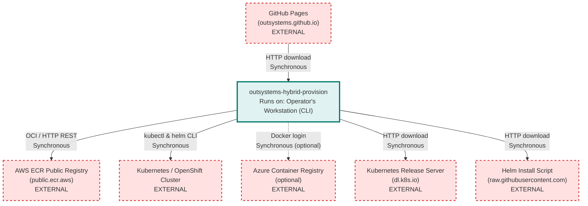

# outsystems-hybrid-provision Architecture

> **Repository:** outsystems-hybrid-provision
> **Runtime Environment:** CLI tool (operator's workstation)
> **Last Updated:** 2026-03-26

## Overview

This repository hosts platform-specific installer scripts (Linux, macOS, Windows) that provision the OutSystems Self-Hosted Operator (SHO) onto a customer's Kubernetes or OpenShift cluster. The scripts run on an operator's local machine and orchestrate Helm-based installation of the SHO operator, which then manages the hybrid ODC platform within the customer's infrastructure.

## Architecture Diagram

## External Integrations

| External Service | Communication Type | Purpose |
|---|---|---|
| AWS ECR Public Registry (`public.ecr.aws`) | Sync (OCI/HTTP REST) | Pull Helm charts and container images for each ring (dev/test/ea/ga) |
| Kubernetes / OpenShift Cluster | Sync (kubectl, helm CLI) | Deploy SHO operator via Helm, manage namespaces, pods, port-forwarding |
| GitHub Pages (`outsystems.github.io`) | Sync (HTTP) | Distribute installer scripts to end users via curl/irm one-liners |
| Azure Container Registry (optional) | Sync (Docker login) | Legacy/backward-compatible registry for customers using ACR (`--use-acr`) |
| Kubernetes Release Server (`dl.k8s.io`) | Sync (HTTP) | Auto-install kubectl if missing on operator's machine |
| Helm Install Script (`raw.githubusercontent.com`) | Sync (HTTP) | Auto-install Helm 3 if missing on operator's machine |
| Chocolatey (`community.chocolatey.org`, Windows only) | Sync (HTTP) | Auto-install jq and curl on Windows via package manager |
| GitHub API (`api.github.com`) | Sync (HTTP REST) | Fetch latest Helm release version (Windows installer) |

## Architectural Tenets

### T1. Single-script, zero-dependency installer experience

Each platform (Linux, macOS, Windows) ships a single self-contained script that auto-detects and installs all prerequisites (kubectl, helm, jq, curl). The user should never need to manually install tooling before running the installer. This lowers the barrier to adoption for customers who may not have a pre-configured workstation.

**Evidence:**
- `scripts/linux-installer.sh` (in `check_dependencies`) - automatically installs kubectl, helm, jq, and curl if missing
- `scripts/windows-installer.ps1` (in dependency checks) - installs Chocolatey, then uses it for jq/curl, downloads kubectl and helm binaries directly

### T2. Ring-based environment isolation with identical script structure

All environment rings (dev, test, ea, ga) use the same script logic; only the `DEFAULT_ENV` variable and corresponding ECR alias differ. The CI pipeline (`main-release.yml`) produces per-ring copies by `sed`-replacing the default environment value. This ensures behavioral parity across rings and prevents ring-specific code drift.

**Evidence:**
- `scripts/linux-installer.sh` (in `setup_environment`) - switches ECR alias based on `ENV` variable; all other logic is shared
- `.github/workflows/main-release.yml` (in `Prepare ring-specific scripts`) - copies scripts per ring and patches only `DEFAULT_ENV`
- `.github/workflows/pr-release.yml` (in `Prepare scripts with dev default`) - PR previews always default to `dev` ring

### T3. ECR Public as the canonical artifact registry

All Helm charts and container images are pulled from AWS ECR Public (`public.ecr.aws`). Each ring has its own ECR alias (e.g., `j0s5s8b0/ga`, `m5i8c6m7/ea`). The ACR path exists only as a temporary backward-compatibility shim and is off by default. New integrations must target ECR Public.

**Evidence:**
- `scripts/linux-installer.sh` (in global constants) - `PUB_REGISTRY="public.ecr.aws"` with per-ring `ECR_ALIAS_*` variables
- `scripts/linux-installer.sh` (in `sho_install`) - ACR path gated behind `USE_ACR` flag with comment "Temporary backward compatibility for Azure ACR"
- `scripts/windows-installer.ps1` (in parameter defaults) - `$use_acr = "false"` by default

### T4. GitHub Pages as the distribution channel for installer scripts

Installer scripts are not distributed via package managers or binary releases. Instead, the CI pipeline publishes them to GitHub Pages, enabling one-liner curl-pipe-bash (or `irm | iex` on Windows) installation. The `gh-pages` branch is the deployment target, and the index page provides per-ring download links.

**Evidence:**
- `.github/workflows/main-release.yml` (in `Deploy to ring directories`) - copies ring scripts to `gh-pages/` branch
- `.github/workflows/main-release.yml` (in `Create index page`) - generates HTML with download links and one-liner install commands
- `.github/workflows/pr-release.yml` (in `Deploy to PR directory`) - PR previews also go to `gh-pages/pr/`

### T5. Helm upgrade-install as the sole deployment mechanism

The scripts use `helm upgrade --install` exclusively for deploying the SHO operator. There is no direct manifest application, no Kustomize, and no custom resource creation outside of Helm. This ensures that Helm is the single source of truth for the deployed state, making rollback and version management straightforward.

**Evidence:**
- `scripts/linux-installer.sh` (in `sho_install`) - uses `helm upgrade --install` with `--create-namespace` for idempotent deployment
- `scripts/linux-installer.sh` (in `sho_uninstall`) - uses `helm uninstall` as the primary teardown, with kubectl only for finalizer cleanup

## Current Phase Constraints

### ACR backward compatibility must be maintained

The `--use-acr` flag and associated ACR login logic exist to support customers who were onboarded before the migration to ECR Public. This path requires `SP_ID`, `SP_SECRET`, and `SH_REGISTRY` environment variables.

> **Expires when:** All customers have migrated to ECR Public and the ACR registry is decommissioned.

**Evidence:**
- `scripts/linux-installer.sh` (in `validate_arguments`) - ACR env var validation gated behind `USE_ACR == "true"`
- `scripts/linux-installer.sh` (line-level comment) - `DEFAULT_USE_ACR="false"  # Temporary backward compatibility for Azure ACR`
